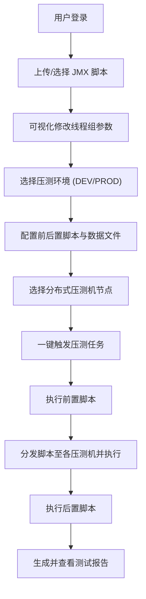

# JMX 极客管理平台 (JMX Geek Manager) - 产品需求文档

## 1. 产品概述
JMX 极客管理平台是一款专为性能测试工程师打造的 JMeter 脚本（JMX文件）集中管理与执行平台。
该平台旨在解决多个 JMX 文件管理混乱、频繁修改线程组需依赖 GUI、多环境配置繁琐、CSV 数据文件路径不一致、前置/后置脚本执行繁琐以及多发压测机协同启动困难等核心痛点，提供一站式、Web化的性能测试脚本调度与管理体验。

## 2. 核心功能

### 2.1 用户角色
| 角色 | 注册方式 | 核心权限 |
|------|----------|----------|
| 管理员 | 系统预设 | 管理系统资源、压测机节点、全局环境配置及用户管理 |
| 测试工程师 | 管理员分配 | 管理个人/团队的 JMX 脚本，配置压测任务，执行压测及查看报告 |

### 2.2 功能模块
1. **控制台首页 (Dashboard)**：展示平台运行状态、压测机节点状态、最近执行的任务及压测资源统计。
2. **脚本管理 (Script Manager)**：JMX 文件的上传、版本管理、在线解析与可视化编辑（如修改线程组参数）。
3. **环境与配置管理 (Environment & Config)**：环境隔离管理（PROD/DEV等），管理不同环境下的 Host、Key 等变量，以及管理 CSV 数据文件路径。
4. **任务调度与执行 (Task Execution)**：配置压测任务，绑定前置/后置脚本，选择执行环境及关联的分布式压测机，一键启动。
5. **压测机管理 (Node Manager)**：添加和管理 Linux/Windows 压测机节点，监控节点状态。

### 2.3 页面详情
| 页面名称 | 模块名称 | 功能描述 |
|----------|----------|----------|
| 控制台首页 | 核心指标展示 | 实时展示压测任务数量、成功/失败率、活跃压测机数量等 |
| 脚本管理 | JMX 文件列表 | 支持按目录、标签管理多个 JMX 文件，支持上传、下载、删除 |
| 脚本管理 | 脚本在线编辑 | 解析 JMX XML，提供可视化表单快速修改“线程数”、“Ramp-up”、“循环次数”等，无需打开 JMeter GUI |
| 环境管理 | 环境变量配置 | 创建 DEV、PROD 等环境，配置对应的全局变量（Host、Token 等），在执行时动态替换 JMX 中的 UDV |
| 数据文件管理 | CSV 文件映射 | 集中管理上传的 CSV 文件，平台在执行时自动抹平本地与 Linux 压测机的绝对路径差异，统一使用相对路径或挂载路径 |
| 任务管理 | 前后置脚本配置 | 针对压测任务配置前置动作（如数据准备）和后置动作（如数据清理），随任务自动触发 |
| 任务管理 | 分布式压测触发 | 选择多个压测机节点，一键下发 JMX 和 CSV 数据并同时启动压测任务，无需逐个登录机器操作 |
| 压测机管理 | 节点列表与监控 | 注册新压测机（IP、端口），查看 CPU/内存等实时状态 |

## 3. 核心流程
1. **脚本准备**：用户上传 JMX 脚本和配套 CSV 文件。
2. **环境配置**：用户在环境管理中维护 DEV/PROD 的相关参数。
3. **参数微调**：用户在 Web 页面直接修改所需执行的线程组参数。
4. **任务编排**：选择 JMX、关联环境、配置前后置脚本、勾选目标压测机。
5. **一键执行**：平台自动组装 JMX（替换变量和路径），分发至压测机，执行前后置脚本，收集压测结果。

## 4. 界面设计设计
### 4.1 设计风格
- **主色调与辅色调**：科技蓝（Primary: #1890ff）为主，配合深邃的暗黑模式（Dark Mode）可选，辅以成功绿和危险红展示状态。
- **按钮风格**：微圆角（border-radius: 6px），扁平化设计，悬浮带有轻微阴影和亮度变化。
- **字体与大小**：Inter 或 Roboto，代码展示区使用 JetBrains Mono，字号 14px 为基准，清晰易读。
- **布局风格**：经典的左侧导航栏 + 顶部面包屑/操作栏 + 右侧主内容卡片式布局。
- **图标风格**：使用线性、极简风格的图标（如 Lucide Icons）。

### 4.2 页面设计概述
| 页面名称 | 模块名称 | UI 元素说明 |
|----------|----------|-------------|
| 脚本管理 | 列表与详情卡片 | 采用分屏布局，左侧为文件树/列表，右侧为 JMX 解析后的表单面板，支持快速保存 |
| 任务配置 | 步骤向导 (Stepper) | 使用分布向导完成“选脚本 -> 配环境 -> 选机器 -> 确认执行”的流程，降低认知负担 |
| 监控大盘 | 实时状态看板 | 使用图表（Echarts/Recharts）展示压测机的 CPU、内存占用率，动效平滑过渡 |

### 4.3 响应式要求
- **优先桌面端**：作为一个偏向后台管理与工程效能的工具，页面布局以 Desktop First 为主（适配 1080p 及以上分辨率）。
- **移动端适配**：对控制台首页和任务状态查看等核心只读页面进行移动端适配，方便工程师在外随时查看压测进度。
