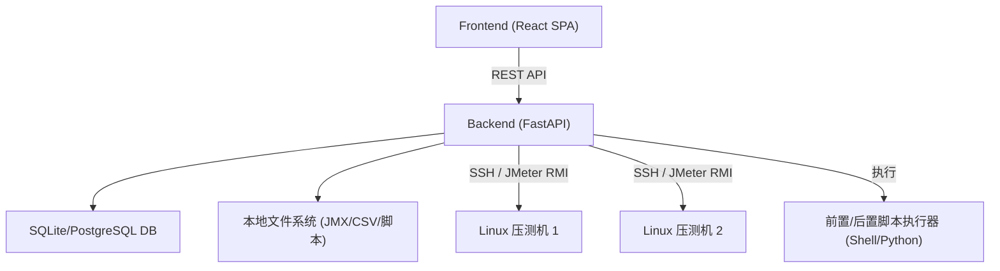
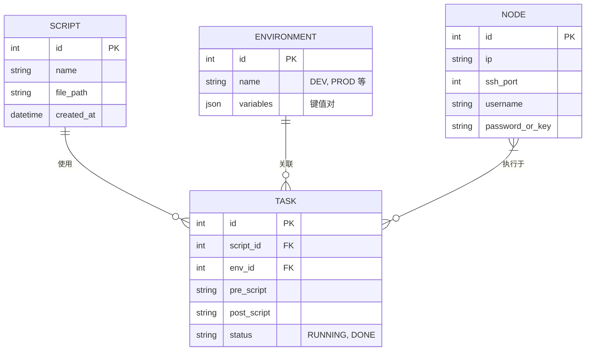

# JMX 极客管理平台 (JMX Geek Manager) - 技术架构文档

## 1. 架构设计
系统采用前后端分离架构，后端负责 JMX XML 解析、文件管理、环境变量替换、前后置脚本执行及与远程压测机的 SSH 通信/JMeter 分布式调度。前端提供用户交互的可视化界面。

## 2. 技术选型
- **前端 (Frontend)**：React@18 + Vite + TailwindCSS@3 + Shadcn UI (或 Ant Design) + Zustand (状态管理) + Axios
- **后端 (Backend)**：Python 3.10+ + FastAPI + SQLAlchemy + Uvicorn
- **数据库 (Database)**：SQLite (默认，易于部署) / PostgreSQL (可选)
- **核心组件**：
  - `lxml` / `xml.etree`: 用于解析和修改 JMX (XML) 文件中的线程组参数 (ThreadGroup) 和用户定义变量 (Arguments)。
  - `paramiko` / `asyncssh`: 用于远程连接 Linux 压测机，上传 JMX 和 CSV 文件，并执行压测命令。
  - `subprocess`: 用于在本地或主控机执行前置/后置脚本。

## 3. 核心路由定义 (前端)
| 路由 | 页面说明 |
|------|----------|
| `/` | 控制台首页 (Dashboard)，展示压测概览和机器状态 |
| `/scripts` | JMX 脚本列表，支持上传、下载、删除 |
| `/scripts/:id/edit` | JMX 脚本在线可视化编辑（线程组参数微调） |
| `/environments` | 环境与配置管理，配置 DEV/PROD 的 Host、Token 等全局变量 |
| `/data-files` | CSV 数据文件管理，集中管理压测所需数据 |
| `/tasks` | 任务调度，配置前后置脚本与选择压测机并执行 |
| `/nodes` | 分布式压测机节点管理 |

## 4. API 接口定义 (后端)
| 接口路径 | 方法 | 说明 |
|----------|------|------|
| `/api/scripts` | GET/POST | 获取脚本列表 / 上传新 JMX 脚本 |
| `/api/scripts/{id}/thread-groups` | GET/PUT | 解析并获取 JMX 的线程组配置 / 更新并保存 JMX 线程组参数 |
| `/api/environments` | GET/POST | 获取环境列表 / 创建环境及对应变量集合 |
| `/api/files/csv` | POST | 上传 CSV 数据文件，统一存储并生成相对映射路径 |
| `/api/tasks/execute` | POST | 触发压测任务：执行前置脚本 -> 替换变量/路径 -> 下发至机器 -> 启动 JMeter -> 执行后置脚本 |
| `/api/nodes` | GET/POST | 获取压测机列表 / 注册新压测机 |

## 5. 核心业务逻辑实现方案
### 5.1 JMX 文件修改 (解决痛点2 & 4)
JMX 本质是 XML 文件。后端接收到用户的修改请求后，定位到 `<ThreadGroup>` 节点，修改对应的 `<stringProp name="ThreadGroup.num_threads">`、`<stringProp name="ThreadGroup.ramp_time">` 等标签；
定位到 `<Arguments>` 节点，动态注入环境变量 (如 Host、Key)，实现不同环境的切换而无需手动修改脚本。

### 5.2 CSV 路径一致性 (解决痛点3)
在 JMX 脚本中，将 CSV 路径统一配置为 `${CSV_DIR}/data.csv` 或相对路径 `./data.csv`。
后端在执行任务时，自动将选中的 CSV 文件通过 SSH (SFTP) 传输到目标压测机 JMeter 执行目录，保证每次压测路径绝对一致，彻底消除 Local 与 Linux 的路径差异。

### 5.3 前置后置脚本与一键启动 (解决痛点5 & 6)
后端任务执行引擎采用异步任务流：
1. `pre_hook`: 调用 `subprocess` 运行用户定义的 Python/Shell 脚本。
2. `distribute`: 自动将修改后的 JMX 和 CSV 并发推送到所有选中的 `Node` 节点。
3. `execute`: 在 Master 节点触发 `jmeter -n -t test.jmx -R node1,node2` 或通过 SSH 在各节点独立启动 JMeter 进程。
4. `post_hook`: 压测结束或中止后，触发清理或通知脚本。

## 6. 数据模型 (Data Model)
### 6.1 ER 图

